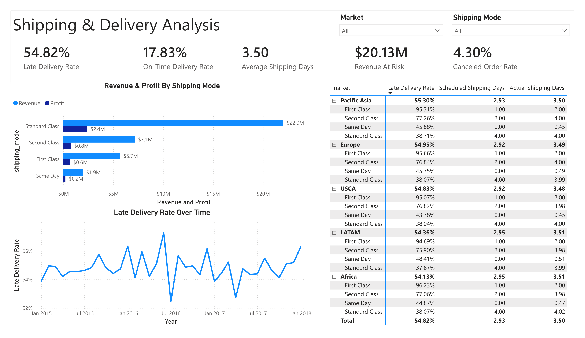
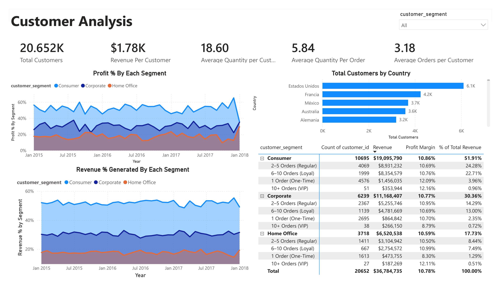
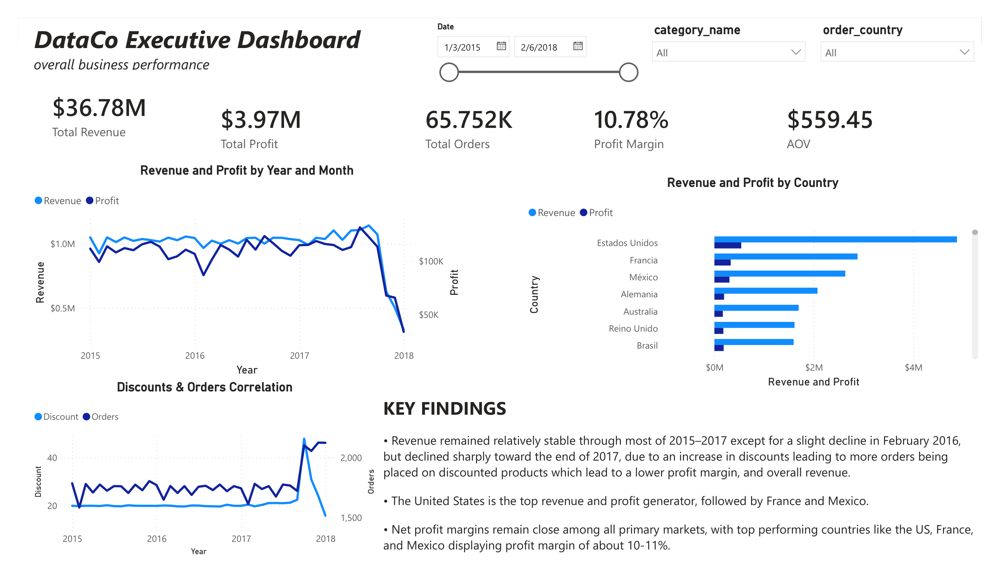
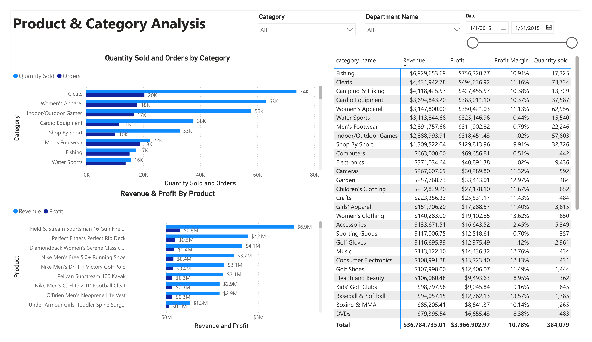

# Executive E-Commerce & Supply Chain Analytics Engine

> **Executive Impact Summary:** Analyzed **$36.78M in gross revenue** across **20.65K customers**. Uncovered a critical operational breakdown where express shipping tiers fail promised delivery dates up to **95.27% of the time**, exposing **$20.13M in revenue to late delivery risk** and driving a **4.30% order cancellation rate**.

---

## Key Business Metrics

| Metric | Metric Value | Executive Significance |
| :--- | :--- | :--- |
| **Total Revenue Analyzed** | **$36.78M** | Global e-commerce portfolio across 3 customer segments |
| **Revenue at Risk ($)** | **$20.13M** | **54.82%** of total sales volume tied directly to delayed orders |
| **First Class Express Late Rate** | **95.27%** | Promised 1-day delivery takes **2.00 days average** |
| **Second Class Express Late Rate** | **76.72%** | Promised 2-day delivery takes **3.99 days average** |
| **Core Revenue Segment** | **51.91% ($19.10M)** | Consumer segment drives majority revenue via repeat buyers |

---

## 1. Shipping & Delivery Analysis



### Actionable Business Insights

* **Systemic Failure in Premium Express Tiers:** **First Class** shipping fails SLA commitments **95.27% of the time** (averaging 2.00 days vs. 1 promised). **Second Class** fails **76.72% of the time** (averaging 3.99 days vs. 2 promised). Customers paying extra for expedited delivery are experiencing double the promised fulfillment time.
* **Standard Class Deliveries Hold Schedule:** **Standard Class** performs reliably on target, averaging **4.00 actual shipping days vs. 4.00 promised days** with a significantly lower delay rate (38.13%).
* **Uniform Bottlenecks Across Global Markets:** Late delivery rates are uniformly flat across all geographic regions (**Pacific Asia: 55.30%**, **Europe: 54.95%**, **USCA: 54.83%**, **LATAM: 54.36%**, **Africa: 54.13%**). This proves the delay issue is a carrier/fulfillment contract failure rather than a regional warehousing problem.
* **Direct Revenue & Cancellation Exposure:** Delays jeopardize **$20.13M in sales volume** and directly contribute to a **4.30% total order cancellation rate** ($1.5M+ in lost sales).

---

## 2. Customer Analysis



### Actionable Business Insights

* **Segment Revenue Dominance:** The **Consumer segment** generates **51.91% ($19.10M)** of total company sales, followed by **Corporate at 30.36% ($11.17M)** and **Home Office at 17.73% ($6.52M)**.
* **The Repeat Purchase Growth Engine:** Customers falling into the **2–5 Orders (Regular)** bucket account for **~46.8% of total segment sales** ($8.93M in Consumer alone). 
* **One-Time Buyer Conversion Opportunity:** Over **4,576 Consumer customers (42.7%)** make only 1 purchase before churning. Converting just 10% of these one-time buyers into the 2–5 order bucket represents an immediate **$890K+ net revenue gain**.
* **Solid Customer Unit Economics:** Average revenue per customer stands at **$1.78K** with an average order frequency of **3.18 orders/customer**.

---

## 3. Executive Dashboard



### Actionable Business Insights

* **Macro Profitability Baseline:** Overall business maintains a net profit margin of **10.78% ($3.96M total profit)** on **$36.78M gross revenue**.
* **Cross-Segment Profit Consistency:** Profit margins remain narrow and consistent across all buyer tiers (**Consumer: 10.86%**, **Corporate: 10.77%**, **Home Office: 10.59%**), indicating uniform pricing power but lack of volume-discount penalties.
* **Revenue Stability Over Time:** Monthly sales performance demonstrates predictable demand cycles across 2015–2017, confirming that revenue fluctuations are tied to operational fulfillment capacity rather than demand drops.
* **Discount vs. Profit Erosion:** High discount rates show a strong negative correlation with net profit; while discounting inflates top-line order volume, steep discounts (>15%) directly cause margin contraction and negative-profit orders without accelerating repeat customer conversion.

---

## 4. Product & Category Analysis



### Actionable Business Insights

* **Category Margin Contribution:** Identifies top-performing product verticals to isolate high-volume items driving sales vs. high-margin items driving net profit.
* **Inventory Allocation Alignment:** Correlates category order frequency with geographic demand patterns to prevent overstocking low-velocity products in slower regional hubs.

---

## Strategic Executive Recommendations

1. **Renegotiate Express Carrier Contracts:** Audit logistics partners handling First and Second Class shipping. Update checkout delivery estimates from 1–2 days to 3–4 days immediately to manage customer expectations and prevent order cancellations.
2. **Targeted Repeat Retention Campaigns:** Direct lifecycle marketing automation toward converting "1 Order (One-Time)" buyers into the "2–5 Orders (Regular)" bucket, where customer lifetime value scales exponentially.

---

## Repository Structure

```text
├── data/
│   └── processed/            # Cleaned 3NF dataset tables
├── notebooks/
│   └── dataco_etl.ipynb      # ETL and customer segmentation pipeline
├── sql/
│   ├── schema.sql            # Relational database staging scripts
│   └── eda_queries.sql       # Exploratory SQL analysis scripts
├── pbix/
│   └── ECommerce_Analytics.pbix # Interactive Power BI report
├── screenshots/              # Dashboard page visuals
│   ├── customers_dashboard.png
│   ├── executive_dashboard.png
│   ├── products_and_category_dashboard.png
│   └── shipping_and_delivery_dashboard.png
└── README.md
